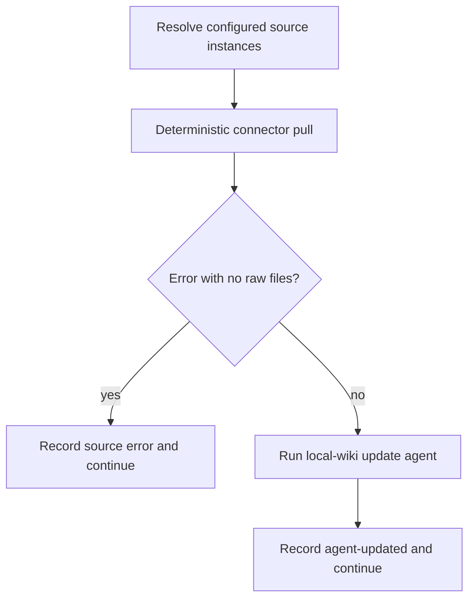

# Personal and repository ingestion workflows

Ingestion has two different orchestration paths. Personal mode turns external
source acquisitions into a private wiki. Repository mode performs managed setup
and optionally augments source-code evidence with code connector observations.

## Personal source loop

`runOpenWikiIngestion` loads private configuration, resolves `all`, a connector
ID, or one validated source-instance ID, then processes configured sources
sequentially. A specific target that matches nothing fails.



Each source first writes raw files, then a source-scoped local-wiki update
synthesizes them. A deterministic error with no usable files short-circuits the
agent for that source. Sources are sequential and failures are isolated, so one
bad connector does not prevent later sources. The pull window is 24 hours
(`repo://src/ingestion/ingestion.ts#L65-L249`).

The update agent receives only the source result and declared raw files. Both
agent output files are validated before concurrent writes begin, but the two
disk writes are not a filesystem transaction; a late write failure can leave
one updated and one old file. Code that needs stronger atomicity must introduce
an explicit staged commit rather than relying on prevalidation.

## Repository setup and augmentation

`ensureCodeModeRepoSetup` refreshes only OpenWiki-managed instruction blocks on
every run. Init may create the scheduled GitHub workflow if absent; later runs
preserve an existing workflow byte-for-byte. Repository instructions outside
the managed markers remain user-owned.

`runCodeModeConnectors` selects code-mode connectors, calculates a pull floor
from last-success metadata, and appends guidance only when a connector produced
data. Absent or invalid timestamps mean no floor. Connector errors are caught
and reported as skipped: runtime observations can enrich a code wiki but cannot
block source-based authoring (`repo://src/ingestion/code-mode.ts#L50-L147`).

## Change impact and proof

Personal ingestion changes may affect target parsing, connector state, per-run
telemetry, sequential isolation, and synthesis prompts. Code setup changes must
preserve managed-block ownership and create-on-init/preserve-afterward workflow
semantics.

```sh
pnpm exec vitest run test/ingestion/ingestion.test.ts \
  test/ingestion/ingestion-run.test.ts \
  test/ingestion/code-mode.test.ts \
  test/ingestion/langsmith-modes.test.ts
```
