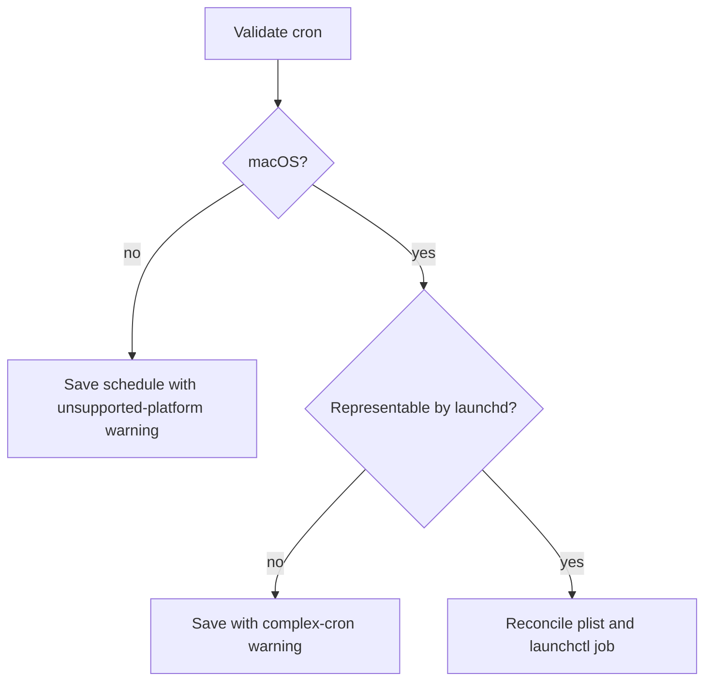

# Scheduling and scheduled-update ownership

There is one global personal-ingestion schedule, not one OS job per connector.
Repository wiki updates use committed CI instead of the personal scheduler.

## Personal scheduling

Cron input is parsed and described before saving. On macOS, a representable
expression becomes a launchd calendar interval and an owner-only LaunchAgent
plist. Installation propagates the OpenWiki config-directory override, unloads
the previous job, writes the new plist, and bootstraps it.



Unsupported platforms and expressions too complex for a launchd calendar
interval remain saved configuration with warnings; they are not silently
claimed as installed. Pause, resume, and delete reconcile the launchd job and
optionally the matching `pmset` wake schedule. Power-management failures are
reported without corrupting the main schedule state
(`repo://src/scheduling/schedules.ts#L88-L203`).

Most OS command behavior is mocked in tests. Treat real launchd/`pmset`
compatibility as an operational validation gap rather than assuming the mocks
prove every macOS version.

## Repository scheduling

Code mode uses `.github/workflows/openwiki-update.yml` (and documented GitLab or
Bitbucket equivalents). Init creates the managed workflow only if missing;
updates preserve operator customization. Workflow changes affect setup,
packaging/examples, permissions, credentials, and PR behavior—not the personal
launchd state machine.

```sh
pnpm exec vitest run test/scheduling test/ingestion/code-mode.test.ts \
  test/cli/schedule-format.test.ts
```
