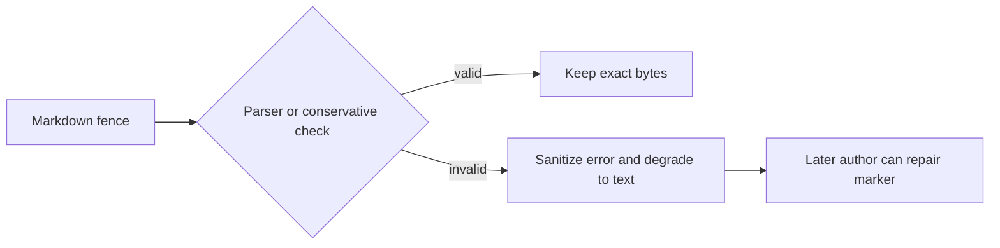

# Visualization graph, server, export, and Mermaid safety

Visualization has two related but separately owned parts: a graph reader/server
for exploring a wiki and a deterministic finalizer that keeps Mermaid from
breaking rendered pages.

## Wiki graph and delivery

`buildGraph` discovers Markdown without following symlinks, derives node IDs
from relative paths, titles/types from frontmatter with fallbacks, and internal
link edges from Markdown. Page reads and routes revalidate containment so a link
cannot escape the selected wiki.

The live server binds only `127.0.0.1`, exposes a fixed route set, increments
through a bounded port range on conflict, and sends debounced rebuilds through
server-sent events. Its CSP restricts scripts and pins external browser
libraries. Static export writes HTML, compiled clients, styles, and `graph.json`;
the exported client has no SSE dependency
(`repo://src/visualize/server.ts#L57-L214`).

Static output is deployable as a directory but not offline: browser Markdown,
graph, and Mermaid libraries are still loaded from pinned public CDNs. Call it
"self-contained" only in the file-layout sense.

## Mermaid finalization

Mermaid validation is the first deterministic finalizer. Optional `mermaid` and
`jsdom` peers provide the authoritative parser; when absent, conservative
heuristics flag only near-certain errors. Valid files remain byte-for-byte
unchanged. Invalid fences become `text` fences with content preserved and a
sanitized, length-bounded repair marker (`repo://src/mermaid/validate.ts#L45-L225`).



Traversal and rendering share the no-symlink and containment posture, but they
have different failure semantics: graph/server failures are operational,
whereas invalid authored diagrams degrade locally so wiki finalization can
continue.

## Proof

```sh
pnpm exec vitest run test/visualize test/mermaid \
  test/copy-visualize-assets.test.ts
```
