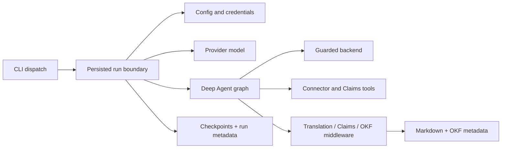

# System architecture and ownership

OpenWiki is a Node 22+ TypeScript CLI that builds and maintains Markdown wikis
with a Deep Agents graph. The same executable exposes interactive and print-mode
agent runs, connector ingestion, scheduling, authentication, visualization, and
coding-agent integrations. `src/cli/cli.tsx` is the process entrypoint;
`runOpenWikiAgent` in `src/agent/index.ts` is the persisted agent-run boundary.

## Two brains, two output modes

The user-facing mode and runtime output target are related but distinct:

| User intent                  | Output mode  | Write target                     | Claims                  |
| ---------------------------- | ------------ | -------------------------------- | ----------------------- |
| Repository code wiki         | `repository` | `<repo>/openwiki/`               | Enabled for init/update |
| Personal knowledge wiki      | `local-wiki` | OpenWiki home `wiki/`            | Disabled                |
| Chat over an existing target | either       | No docs-only authoring lifecycle | Disabled                |

Code mode adds repository setup, `.openwikiignore`, source evidence, Claims,
transactional init replacement, and a scheduled-update workflow. Personal mode
adds connector ingestion and stores all durable state below the OpenWiki home.

## Runtime composition

The major ownership boundaries are intentionally separate:

- **CLI** parses and selects a runner; it does not own generation semantics.
- **Agent runtime** owns model construction, checkpointing, streaming, run
  metadata, and repository init transaction boundaries.
- **Backend** owns filesystem and shell confinement against untrusted model
  behavior and repository content.
- **Claims** owns factual grounding state and repository evidence freshness.
- **OKF/finalizers** own deterministic Markdown metadata and index repair.
- **Connectors/ingestion** own external-source acquisition and personal-wiki
  synthesis.
- **Host integrations** replace the model loop with native coding-agent
  authoring while retaining deterministic setup, Claims, and finalization.

## Cross-system flows

The five flows most likely to cross an editing boundary are:

1. **Repository init:** CLI → code-mode setup → wiki replacement → Claims
   runtime → agent/middleware → finalizers → replacement commit.
2. **Repository update:** preflight/no-op → existing wiki context → model and
   Claims reconciliation → finalizers → complete/interrupted metadata.
3. **Personal ingestion:** onboarding config → connector registry/runtime → raw
   files/manifests → source-scoped synthesis → local wiki.
4. **Host-authored wiki:** installer → MCP protocol → session manager → native
   host edits → Claims/finalizers → commit.
5. **Read-only coding context:** task/path ranking → one-hop contract impact →
   bounded source/test routing. The host verifies returned context against the
   repository without starting an authoring lifecycle.

Each flow has a dedicated page because changes at one end often require proof at
the other. The [run lifecycle](run-lifecycle.md), [host lifecycle](../integrations/host-lifecycle.md),
and [ingestion](../data/ingestion.md) pages carry the detailed ordering.

## Primary evidence and proof

- Entry and command dispatch: `src/cli/cli.tsx`, `src/cli/commands.ts`
- Persisted run boundary: `src/agent/index.ts:L161-L347`
- Runtime graph composition: `src/agent/index.ts:L525-L635`
- Mode types: `src/agent/types.ts:L1-L6`
- Package/runtime contract: `package.json`, `tsconfig.json`

Start validation with `pnpm run typecheck` plus the focused domain tests. Use
`pnpm test` only when a change crosses several ownership boundaries or affects
build/package output.
