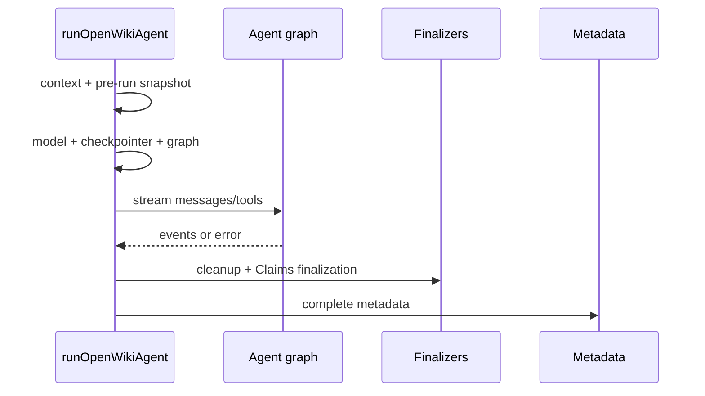

# Persisted run lifecycle

`runOpenWikiAgent` is the complete persisted run boundary. The lower-level graph
factory does not own successful Claims finalization, completion metadata, or
repository replacement commit.

## Preparation and mode-specific ordering

The run defaults to the private local wiki unless its caller explicitly selects
an output mode. It loads the OpenWiki home environment and synchronizes bundled
skills before ignore rules, Claims, provider setup, or model construction
(`src/agent/index.ts:L161-L188`).

Repository **update** prepares Claims before provider resolution so invalid or
unsafe sidecars fail without requiring credentials. Repository **init** starts
the wiki replacement first, then prepares an empty Claims session; old sidecars
must not leak into a regenerated wiki (`src/agent/index.ts:L194-L223`,
`L280-L316`).

## Update no-op

A message-free update may skip the model only when prior metadata is complete,
language is unchanged, and Git/worktree checks find no meaningful non-wiki,
non-ignored change. The no-op path still finalizes Claims, refreshes last-update
metadata best-effort, emits a result, and records telemetry outcome `noop`
(`src/agent/utils.ts:L95-L179`, `src/agent/index.ts:L225-L265`). A user message
explicitly bypasses this optimization.

## Normal execution



The stream boundary registers the crash guard only while consuming events. On a
stream failure it removes temporary files best-effort, records `interrupted`
metadata without replacing the original error, clears the active crash record,
and prunes checkpoint history best-effort (`src/agent/index.ts:L637-L825`).

After a successful stream, persistent checkpoint permissions are tightened,
temporary control files are removed, Claims finalize, and only then complete
metadata is persisted. A finalization error instead records interrupted status
and propagates (`src/agent/index.ts:L827-L872`).

Chat checkpoints persist in the private SQLite database; init/update use
memory-only checkpoints. Old chat checkpoint namespaces are pruned without
making pruning failure fatal (`src/agent/index.ts:L1027-L1124`).

## Transactional init

When an `openwiki/` directory already exists, init backs it up and initially
preserves only a regular non-symlinked `INSTRUCTIONS.md`. Any run/finalization
error or termination signal rolls back. Commit occurs only after the persisted
run boundary succeeds (`src/agent/wiki-replacement.ts:L25-L195`,
`src/agent/index.ts:L284-L335`). If no wiki existed, replacement is a no-op and
normal partial-run recovery applies.

## Proof and change impact

- Lifecycle/Claims ordering: `test/agent/claims-run-lifecycle.test.ts`
- Replacement and signals: `test/agent/wiki-replacement.test.ts`
- No-op matrix: `test/agent/update-noop.test.ts`
- Fatal crash handling: `test/agent/crash-guard.test.ts`
- Checkpoints: `test/agent/checkpoint-policy.test.ts`,
  `test/agent/checkpoint-pruning.test.ts`

Completion ordering changes must audit Claims, metadata, replacement, crash
guard, and telemetry together. Moving complete metadata or replacement commit
earlier breaks recovery guarantees.

```sh
pnpm exec vitest run test/agent/claims-run-lifecycle.test.ts \
  test/agent/wiki-replacement.test.ts test/agent/update-noop.test.ts \
  test/agent/crash-guard.test.ts
```
