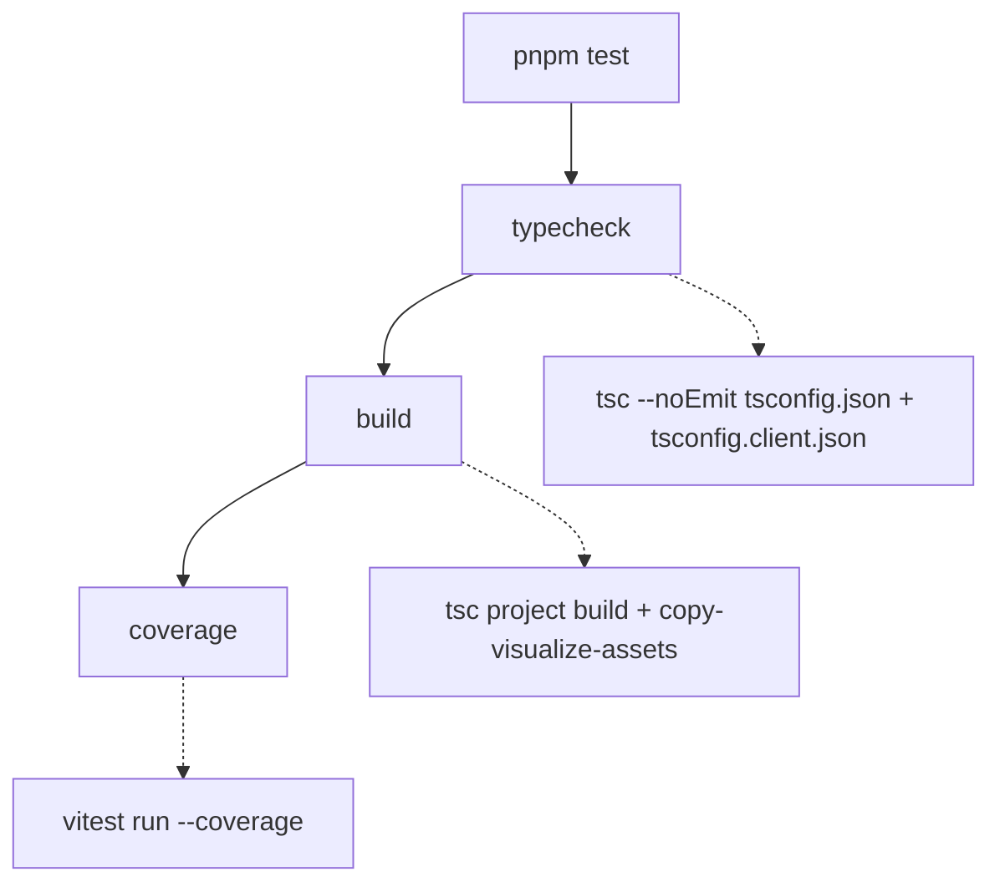

# Testing Guide

OpenWiki is validated by a single [Vitest](https://vitest.dev) suite under `test/`.
The suite is fast, mostly offline (external services and SDKs are stubbed), and
mirrors the `src/` tree directory-for-directory so that the tests for a subsystem
live at the matching path. This page explains the tooling, the full `pnpm test`
pipeline, and — for each subsystem — the narrowest command that proves a change
while preserving complete failure output.

## Tooling

- **Test runner: Vitest.** `vitest` (and `@vitest/coverage-v8`) are dev
  dependencies; there is no separate framework. Tests import `describe`,
  `expect`, `test`, `vi`, and the `beforeEach`/`afterEach` hooks directly from
  `vitest`.
- **Ink component tests: ink-testing-library.** Terminal UI written with Ink is
  exercised by rendering React components with `render` from
  `ink-testing-library` and asserting on the rendered frame (`lastFrame()`).
  These tests are the `.tsx` files under `test/cli/components/` and
  `test/setup/credentials/`.
- **No global config beyond `vitest.config.ts`.** Test discovery keeps Vitest's
  defaults; the only tuning is one discovery exclusion and the coverage block
  (see below).

Tests import source modules directly by relative path (for example
`../../src/agent/index.ts`), so a source module can be unit-tested without
building `dist/` first. `tsx` runs the CLI in development (`pnpm dev`), but the
test suite itself runs through Vitest's own transform.

## The `pnpm test` pipeline

`pnpm test` is not just the unit run — it is a three-stage gate that must pass in
order:

The `pnpm test` gate: typecheck, then build, then the coverage run.

1. **`typecheck`** runs `tsc --noEmit` against both the server project
   (`tsconfig.json`) and the browser/client project (`tsconfig.client.json`).
2. **`build`** compiles both TypeScript projects and copies the visualize
   client assets.
3. **`coverage`** runs `vitest run --coverage`, which executes every test and
   produces a coverage report.

When iterating locally you usually do **not** want the whole gate. Run Vitest
directly (`pnpm exec vitest run <path-or-pattern>`) to execute a focused slice,
then run `pnpm test` once before proposing the change so typecheck, build, and
coverage all agree.

## Coverage configuration

Coverage uses the V8 provider with `all: true` and an explicit
`include: ["src/**/*.{ts,tsx}"]`. `all: true` plus the explicit include makes the
report cover the **entire** `src` tree, so a source file that no test imports yet
appears as 0% rather than being silently omitted from the denominator.

A small set of files are deliberately excluded from coverage because they emit no
runtime JavaScript or can only run in an environment a Node unit test cannot
drive: `*.d.ts`, pure `types.ts` declaration modules, the `telemetry/index.ts`
re-export barrel, the browser-only `visualize/client.ts`, and the Ink keyboard
state machine `setup/credentials/use-init-setup.ts`. In each excluded case the
extractable pure logic lives in a separate, tested module (for example
`visualize/client-lib.ts`, or `steps.ts`/`format.ts`/`persistence.ts` for the
setup wizard), so new logic belongs in those tested modules rather than in the
excluded glue. The coverage reporters are `text`, `text-summary`, `html`,
`json-summary`, and `lcov`.

## Test discovery

Vitest keeps its default discovery globs and adds exactly one exclusion:
`**/benchmarks/*/repo/**`. A KEB benchmark under `evals/keb/benchmarks/` can
rebuild an upstream project's source tree into a `repo/` directory that carries
that project's own `*.test.ts` files. Those belong to the fixture under test, not
to OpenWiki, so the exclusion guarantees that a benchmark whose `repo/` happens
to be present on disk cannot pollute this project's suite.

## Test layout maps to source subsystems

`test/` mirrors `src/`. To find (or add) tests for a subsystem, go to the
matching path. The most important mappings:

| Test directory                                                                                                                                            | Source subsystem it validates                                                                                 |
| --------------------------------------------------------------------------------------------------------------------------------------------------------- | ------------------------------------------------------------------------------------------------------------- |
| `test/agent/`                                                                                                                                             | `src/agent/` — model creation, middleware, prompts, streaming, redaction, the repository runner, OKF middleware, frontmatter validation, and the wiki finalizer |
| `test/claims/`                                                                                                                                            | `src/claims/` — grounded-claim core, the code claim brain, and evidence resolution                            |
| `test/connectors/`                                                                                                                                        | `src/connectors/` — connector config, resilient fetch, MCP client/runtime, and per-source ingestion           |
| `test/generation/`                                                                                                                                        | `src/generation/` — repository planning, page jobs, and run-state persistence                                 |
| `test/okf/`                                                                                                                                              | `src/okf/` — OKF frontmatter parsing/normalization/repair/validation and index labels/sync |
| `test/integrations/`                                                                                                                                      | `src/integrations/` — host installers, config adapters, the MCP server, and packaged skill/protocol contracts |
| `test/cli/`                                                                                                                                               | `src/cli/` — CLI wiring and Ink components                                                                    |
| `test/setup/`                                                                                                                                             | `src/setup/` — the credentials setup wizard                                                                   |
| `test/config/`, `test/mermaid/`, `test/visualize/`, `test/scheduling/`, `test/telemetry/`, `test/auth/`, `test/ingestion/`, `test/platform/` | the matching `src/` subsystem (e.g. `test/visualize/` covers the visualizer page contract and jsdom client-interaction wiring) |

Related architecture and subsystem pages: the
[source map](../architecture/source-map.md),
[grounded claims](../concepts/grounded-claims.md),
[coding-agent integrations](../integrations/coding-agents.md), and the
[repository generation workflow](../workflows/repository-generation.md).

### Agent: middleware, frontmatter, and finalizer

The agent subsystem directory holds a broad set of tests, including several that
guard the OKF authoring pipeline added in the v0.4.0 cycle:

- `test/agent/frontmatter-validator.test.ts` exercises `validateOkfFrontmatter`
  in isolation, asserting which OKF frontmatter families are accepted (required
  `type`, optional `title`/`description`/`resource`/`tags`, the legacy v0.1
  `timestamp`/producer extensions, and the v0.2 provenance/trust/lifecycle
  families) and which malformed inputs are rejected (timestamps without an
  explicit UTC offset, impossible ISO-shaped timestamps).
- `test/agent/index-middleware.test.ts` drives `createOpenWikiIndexMiddleware`
  against a real `OpenWikiLocalShellBackend` rooted in an `mkdtemp` directory. It
  runs the middleware's `beforeAgent`/`afterAgent` lifecycle hooks, asserts the
  projected source IDs and index labels, and feeds broken Mermaid blocks to prove
  index sync fails on unparseable diagrams.
- `test/agent/wiki-finalizer.test.ts` exercises `prepareWikiForAuthoring` and
  `finalizeWikiArtifacts` against an isolated repository-mode backend, capturing
  the operation sequence (`migrate`, `provenance_snapshot`) and asserting on the
  persisted content written to the real filesystem.

### Agent: the repository-runner harness

`test/agent/repository-runner.test.ts` is the harness for the native repository
worker (`runNativeRepositoryGeneration` in `src/agent/repository-runner.ts`). It
does not build a real agent: it `vi.mock("deepagents")` to capture the agent
options the runner passes to `createDeepAgent` and to drive a scripted stream
that yields `read_file`/`write_file` tool events and then either calls the
completion tool (`submit_plan`/`submit_page`) or exits without submitting. The
same mock wraps `createFilesystemMiddleware` so the test can record the exact
tool surface handed to each worker. A second `vi.mock` replaces
`src/generation/repository-run.js` with an in-memory run-state harness so begin,
plan submission, page queuing, page submission, and finish can be driven
without touching disk. A `runHarness()` helper captures the full
`OpenWikiRunEvent[]` stream emitted by the runner.

The harness verifies the worker model the runner enforces, and the failure
semantics around it:

- **Tool surface and worker isolation.** The planner gets a read-only surface
  (`read_file`, `ls`, `glob`, `grep`) with no `execute` or `task` tool; each
  page worker gets a fresh agent with `read_file`, `ls`, `glob`, `grep`,
  `write_file`, `edit_file`, and a system prompt that owns exactly one page.
  Worker narration (`messages`) events are filtered out of the public event
  stream; only approved `tool_start`/`tool_end` events surface.
- **Completion-tool rejection and retry.** Invalid `submit_page` and `submit_plan`
  payloads come back as `ToolMessage` errors (with a `retry` hint) for the agent
  to correct and retry, and the run still reaches `finish`.
- **No-delegation middleware.** The planner's model-call middleware filters
  `task` out of the model's tool list, so DeepAgents' automatic delegation is
  disabled at the model boundary.
- **Source-drift replanning.** When `finishRepositoryRun` reports a `conflict`
  (source changed during the run), the runner re-begins and replans: `begin` and
  `finish` are each called twice, four agents are constructed across the two
  cycles, and the event stream carries a `replanning` stage.
- **Skip-failed-worker.** The `workerExitsWithoutSubmit` flag makes a page
  worker's stream end without ever calling `submit_page`. The harness proves the
  runner calls `skipRepositoryPage` exactly once for that page, leaves it as
  `skipped`, lets the subsequent page continue to `complete`, still reaches
  `finish` exactly once, and emits a `text` event noting the page will be
  reconsidered on the next update.
- **Resume and no-op.** A resumed run does not recreate the planner (only one
  agent is constructed, over the pending page); a strict no-op short-circuits
  before constructing any worker and emits a single `noop` progress event.

The `parseWorkerToolEvent` block additionally unit-tests the event filter in
isolation, asserting it forwards only approved tool lifecycle events and drops
`execute`/`task` tool starts and `messages` narration.

### Claims: nested layout

`test/claims/` splits by the claims subsystem's own internal boundaries:
`test/claims/core/` (the resolver-agnostic mutation and error model, e.g.
`applyClaimOperations`/`cloneClaims`), `test/claims/brains/code/` (the code claim
brain — paths, preflight, runtime, session, store), and
`test/claims/evidence/repository/` (repository evidence resource parsing and the
resolver). This mirrors the `src/claims/` split between core, brain, and evidence
concerns.

### Connectors: shared machinery vs. per-source

`test/connectors/` keeps cross-cutting machinery at the top level
(`connector-config*`, `fetch-with-resilience`, `mcp-client`, `mcp-runtime`,
`raw-connector-tools`, `tools`) and puts each individual source under
`test/connectors/sources/` (git-repo, gmail, hackernews, mcp, slack, web-search,
x, langsmith, custom-mcp). A source's pure logic is often private and only
observable through its `ingest()` entry point, so those tests point `$HOME` at a
throwaway temp directory, feed controlled API responses through a stubbed
`fetch`, and assert on the request the connector builds and the normalized raw
dump it writes to disk — no real network call or OAuth token is involved. To add
a new connector, use the `write-connector` skill and add a matching test under
`test/connectors/sources/`.

### OKF: frontmatter and index

`test/okf/` mirrors `src/okf/`. `test/okf/frontmatter.test.ts` is the broadest
OKF frontmatter suite: it covers `normalizeConceptContent` (regenerating
frontmatter for bare pages, repairing optional fields while preserving
producer-defined extensions, stamping a localized concept type), and the
`parseFrontmatterFields`/`renderFrontmatter`/`validateOkfFrontmatter`/
`repairOkfFrontmatter`/`validatePersistedFile` helpers. Sibling files
(`test/okf/index-labels.test.ts`, `test/okf/index-sync-errors.test.ts`,
`test/okf/claims-verification.test.ts`, `test/okf/claim-sources.test.ts`) cover
index labels, index-sync error paths, and claims verification/source projection.

### Visualizer: page contract and client interaction

`test/visualize/` guards the browser-side visualizer. The suite is split between
the static page contract (`page.test.ts`) and the client's interaction wiring
(`client-interaction.test.ts`):

- `test/visualize/page.test.ts` asserts on the `PAGE` and `STATIC_PAGE` strings
  exported from `src/visualize/page.ts` — the full HTML documents served to the
  browser and the static export. It verifies the document is a complete HTML page,
  loads styles from an external stylesheet (never an inline `<style>`), pins each
  CDN script (`force-graph`, `marked`, `dompurify`, `mermaid`) to an exact version
  with an SRI `integrity`/`crossorigin` pair so a bumped version must go through a
  fresh hash review, and confirms every CDN script is SRI-protected with no
  unprotected script slipping in. Two tests guard the issue #670 overlay
  regression: the hint and legend elements must be anchored inside `#graph`
  (inside `#graph-overlay`), not as direct children of `.main`, and the stylesheet
  must keep `.graph-overlay` height-capped with a `max-height` and the `.legend`
  scrollable with `overflow-y: auto` (and no longer `position: absolute`), so a
  wiki with many page types cannot regrow a full-width bar that covers the
  sidebar and reader.
- `test/visualize/client-interaction.test.ts` runs under the `jsdom` environment
  (via a `// @vitest-environment jsdom` pragma). `src/visualize/client.ts` is
  browser-only render glue that touches the DOM at import time and drives CDN
  globals, so the test mounts a minimal DOM mirroring `page.ts`, stubs the
  third-party globals (`ForceGraph`, `marked`, `DOMPurify`, `mermaid`,
  `ResizeObserver`, `fetch`), sets `document.documentElement.dataset.staticExport`
  to skip the SSE connection, and then imports the client. It records the
  handlers the client registers on the force-graph instance and asserts that node
  click and hover handlers are wired. The issue #670 regression is the central
  case: background clicks must not be wired to any handler — `onBackgroundClick`
  is never called, so `backgroundClickHandler` stays `undefined` — and a selected
  page therefore stays open (clicking a node renders it into `#detail` and the
  empty reader placeholder never returns). A final test confirms selecting a node
  highlights the matching sidebar entry. `vi.resetModules()` in `beforeEach` and
  `vi.unstubAllGlobals()` in `afterEach` keep each test's import isolated.

## Testing patterns you will reuse

- **Dependency injection via `vi.mock` + `vi.hoisted`.** Failure-path tests
  wrap a real module with `vi.mock(..., importOriginal)` and use a hoisted
  counter to inject a failure on the Nth call while otherwise delegating to the
  real implementation. `test/generation/repository-run.test.ts`, for example,
  intercepts `writeLastUpdateMetadata`, `writeRepositoryRunState`, and
  `removeRepositoryRunState` this way to inject metadata-write and run-state
  write/removal failures and prove the runner's recovery behavior. These tests
  import the source modules directly (e.g. `../../src/okf/frontmatter.ts`,
  `../../src/generation/repository-run.ts`) so the run lifecycle is exercised
  through Vitest's transform without first building `dist/`.
- **Real filesystem in a temp dir.** Tests that exercise on-disk behavior create
  an OS temp directory (`mkdtemp`), redirect `$HOME`/`USERPROFILE` or
  `OPENWIKI_CONFIG_DIR` into it, and clean up in `afterEach`. This keeps the
  suite hermetic without mocking `fs`.
- **Ink render assertions.** Component tests render with `ink-testing-library`
  and assert on `lastFrame()`, stripping ANSI first (via the shared
  `test/cli/components/ansi.ts` helper) so assertions match plain text.
- **DOM shim for Mermaid.** Tests that touch Mermaid validation call
  `ensureDomGlobals()` from `src/mermaid/dom-shim.ts` to install jsdom's
  window/document globals.
- **jsdom + stubbed CDN globals for the visualizer.** Tests that need a real DOM
  opt into the `jsdom` environment with a `// @vitest-environment jsdom` comment
  at the top of the file (see `test/visualize/client-interaction.test.ts`). They
  mount a minimal DOM, stub the browser globals the module touches at import time
  (`ForceGraph`, `marked`, `DOMPurify`, `mermaid`, `ResizeObserver`, `fetch`),
  then import the module under test; `vi.resetModules()` per test and
  `vi.unstubAllGlobals()` on teardown keep imports hermetic.

### The repository-run lifecycle test

`test/generation/repository-run.test.ts` is the end-to-end integration test for
the repository generation workflow. It imports `parseFrontmatterFields` and
`validateOkfFrontmatter` from `src/okf/frontmatter.ts`, `ClaimsStore` and
`ClaimsPersistenceError` from the claims modules, and the full run lifecycle
(`beginRepositoryRun`, `submitRepositoryPlan`, `nextRepositoryPage`,
`submitRepositoryPage`, `finishRepositoryRun`, plus `captureRepositoryPageSnapshot`
and `skipRepositoryPage`) from `src/generation/repository-run.ts`, and drives the
begin → submit_plan → next_page → submit_page → finish lifecycle against a
temporary committed Git repository.

A `failureHarness` created with `vi.hoisted` wraps the real `src/agent/utils.js`
and `src/generation/run-state.js` modules to inject failures on selected calls
while otherwise delegating to the real implementation: it intercepts
`writeLastUpdateMetadata`, `writeRepositoryRunState`, and `removeRepositoryRunState`
to inject metadata-write and run-state write/removal failures. Each test creates a
committed Git repository (via the `git`/`createRepository` helpers), arms the
failure counters in `beforeEach`, and removes the temporary directories in
`afterEach`, so recovery and rollback paths are exercised against a real
repository without leaving state behind. The suite is organized into
`describe` blocks that mirror the lifecycle phases:

- **Snapshot restoration.** The `restores the exact pending Markdown and Claims
  snapshot` test captures a page snapshot, mutates the page and its Claims store
  after capture, calls `skipRepositoryPage`, and asserts the on-disk Markdown and
  the `ClaimsStore` sidecar revert to the snapshot bytes while the job becomes
  `skipped`; it then finishes with `skippedPageSnapshots` and asserts the run
  state is removed and `.last-update.json` records an `interrupted` status.
- **Queue resume.** `resets an interrupted skipped job to pending on resume`
  skips the first job of a two-page plan, re-begins the run, and asserts the
  skipped job is restored to `pending` (not `skipped`) and is the page
  `nextRepositoryPage` returns.
- **Begin/finish hardening.** The `beginRepositoryRun` block proves a metadata
  write failure rolls back a fresh init and removes the new run state, a clean
  Git-clean update is a strict no-op, a stale-Claim preflight prevents the skip,
  and resume rejects mode/language/producer conflicts while accepting a
  same-owner resume. The `repository page queue` block keeps in-memory state
  unchanged until plan persistence succeeds, does not complete a page until Claims
  and checkpoint state are durable, keeps a durably-claimed page pending when
  completion checkpointing fails, and rejects out-of-order submission while
  repairing invalid frontmatter. The `finishRepositoryRun` block invalidates the
  whole plan on drift (removing only abandoned new pages), does not mutate active
  state when durable drift invalidation fails, rechecks source after
  deterministic finalization, applies explicit page deletions with Claims
  cleanup, and leaves a fully finalized run resumable when final state removal
  fails. The `update hardening` block covers end-to-end update scenarios: a new
  source file produces a planned page completed durably, a deleted source that
  makes a Claim unresolved queues the owning page, a language change queues every
  existing factual page for rewrite, an unaffected page is left byte-for-byte
  unchanged, and an interrupted update resumes from its first pending page.

## Choosing the narrowest validation per subsystem

Run the smallest slice that would fail if your change is wrong, then run the full
`pnpm test` gate before finishing. Use `pnpm exec vitest run <path>` to scope by
file or directory, or `-t "<name>"` to scope by test name.

- **A single subsystem:** `pnpm exec vitest run test/generation/` (swap in the
  matching directory from the table above).
- **A single file:** `pnpm exec vitest run test/agent/repository-runner.test.ts`.
- **A single connector source:** `pnpm exec vitest run test/connectors/sources/slack.test.ts`.
- **A single named test:** `pnpm exec vitest run test/config -t "treats whitespace-only overrides as unset"`.
- **Ink components:** `pnpm exec vitest run test/cli/components/`.
- **Visualizer:** `pnpm exec vitest run test/visualize/` (page contract + jsdom client interaction).

Because tests import `src/` directly, a focused Vitest run does not require a
prior `pnpm build`. Reserve the full `pnpm test` (typecheck + build + coverage)
for confirming the change end-to-end.

### Preserve complete failure output

When a scoped run fails, capture the **entire** Vitest failure block — the failed
test name, the full assertion diff (expected vs. received), and the complete stack
trace — not a summarized line. The diff and stack are what let a reviewer or
follow-up run locate the regression. Do not truncate an assertion diff or drop
stack frames when reporting a failure.

## End-to-end and gated tests

Most of the suite is offline unit and integration tests. A small number of files
are named `*.e2e.test.ts` (for example
`test/agent/gemini-enterprise-claude.e2e.test.ts`) and exercise a real vendor SDK
path rather than a mock — that test drives the real Anthropic Vertex SDK plus the
real Mermaid DOM shim to guard the browser-guard workaround, using a throwaway
offline credentials file so no real token or network request is involved. These
still run in the default suite; they are named to signal that they cross an
integration boundary rather than testing a unit in isolation.
